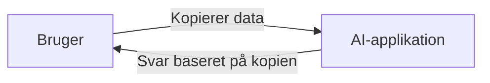
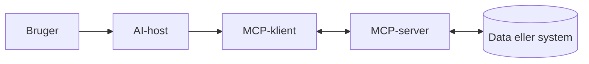
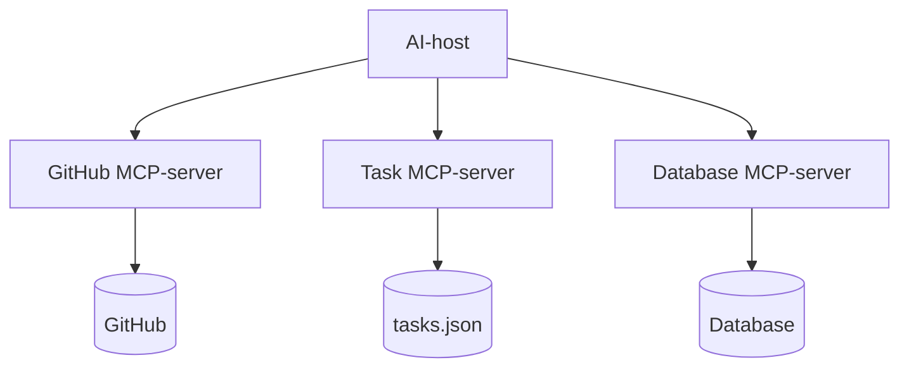
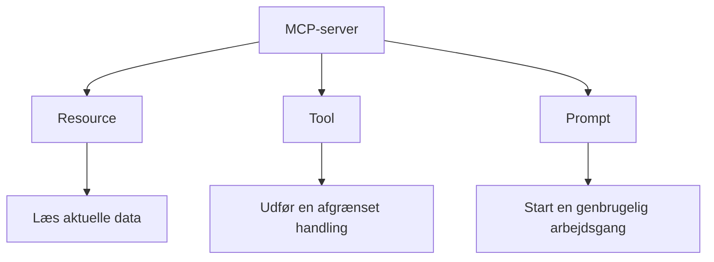
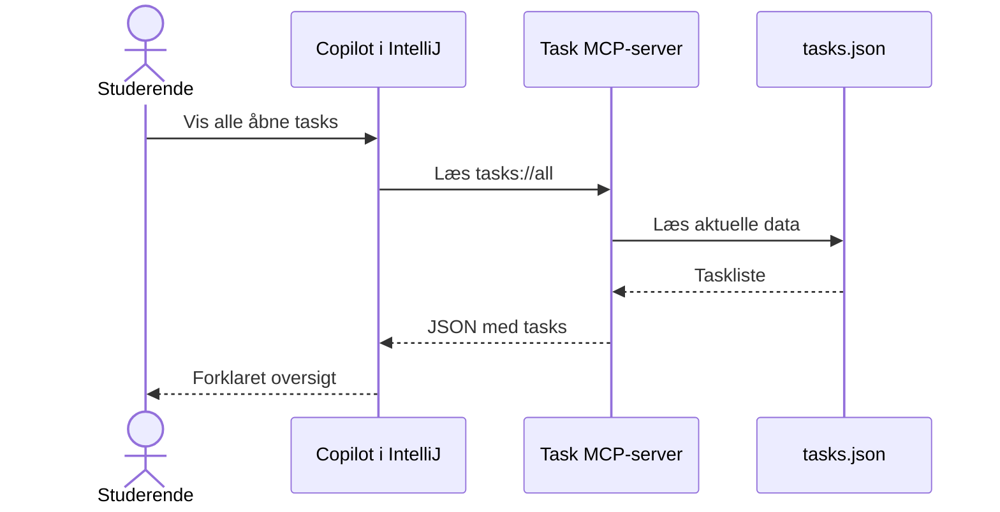
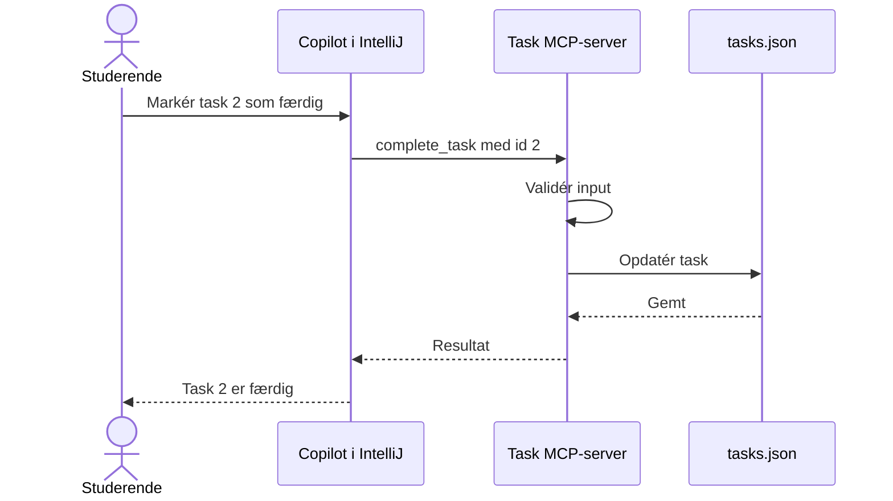
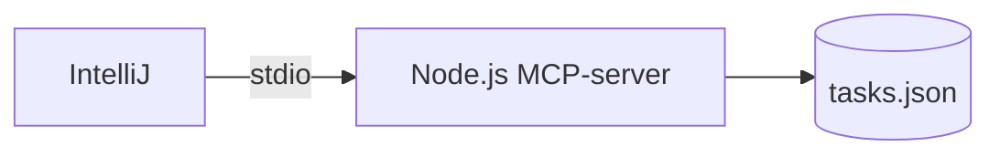
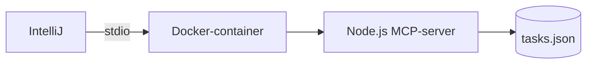

# MCP - fra AI-samtale til handling

Model Context Protocol, forkortet MCP, er en åben standard, der gør det muligt at forbinde en AI-applikation med eksterne data, værktøjer og arbejdsgange.

En sprogmodel kan som udgangspunkt kun arbejde med den kontekst, den får i samtalen. Den ved ikke automatisk, hvad der står i en lokal fil, hvilke opgaver der ligger i et projekt, eller hvordan et bestemt system skal ændres. MCP giver AI-applikationen en standardiseret og kontrolleret forbindelse til sådanne systemer.

MCP kan eksempelvis bruges til at lade en AI-agent:

- læse aktuelle data fra en fil, database eller et API
- kalde en afgrænset funktion
- oprette eller ændre data gennem et godkendt værktøj
- anvende en genbrugelig prompt eller arbejdsgang
- arbejde med GitHub Issues, pull requests og Projects

MCP gør ikke sprogmodellen mere intelligent. MCP giver den adgang til aktuelle data og tilladte handlinger.

## Eksempler på hvor MCP giver mening

MCP er især nyttigt, når en AI skal arbejde med data eller systemer uden for selve samtalen.

Eksempler:

- **GitHub:** AI kan læse Issues, oprette nye Issues og arbejde med pull requests.
- **Database:** AI kan hente aktuelle kunder, produkter eller opgaver fra en database.
- **Filsystem:** AI kan læse projektfiler, konfiguration eller lokale dokumenter.
- **Studieopgaver:** AI kan hente aktuelle tasks, oprette nye og markere dem som færdige.
- **Virksomhedssystem:** AI kan slå data op i fx et CRM-, helpdesk- eller bookingsystem.
- **API'er:** AI kan hente aktuelle data fra fx vejr-, økonomi- eller interne API'er.

Kort sagt: **MCP giver mening, når AI ikke bare skal svare, men også skal kunne hente aktuelle data eller udføre kontrollerede handlinger i andre systemer.**

## Problemet MCP løser

Uden MCP skal brugeren ofte kopiere data ind i samtalen:



Kopien kan være forældet, ufuldstændig eller forkert. AI-applikationen kan heller ikke udføre en reel handling i det eksterne system.

Med MCP kan AI-applikationen hente aktuelle data og anvende de værktøjer, som en MCP-server stiller til rådighed:



## Roller i MCP

| Rolle | Ansvar | Eksempel i materialet |
| --- | --- | --- |
| Bruger | Beskriver behovet og godkender handlinger | Den studerende |
| AI-host | Indeholder samtalen, modellen og brugergrænsefladen | Copilot Chat i IntelliJ |
| MCP-klient | Opretter forbindelsen og sender MCP-beskeder | En del af AI-hosten |
| MCP-server | Beskriver og udfører afgrænsede funktioner | Vores Node.js task-server |
| Eksternt system | Indeholder de data, der arbejdes med | `tasks.json` |

En AI-host kan være forbundet med flere MCP-servere. Hver server kan give adgang til sit eget afgrænsede område.



## Hvad stiller en MCP-server til rådighed?

En MCP-server kan især stille resources, tools og prompts til rådighed.



### Resources

En resource er data, som klienten kan læse. Den svarer nogenlunde til en fil eller et læsbart API-svar.

I vores eksempel findes denne resource:

```text
tasks://all
```

Den returnerer den aktuelle taskliste fra `tasks.json`.

### Tools

Et tool er en funktion, som modellen kan anmode om at få udført. Tool-kald valideres mod et inputskema, før serverens kode bliver kørt.

Vores server har to tools:

```text
add_task
complete_task
```

Et tool bør udføre en afgrænset og tydeligt beskrevet handling. Det er serveren - ikke sprogmodellen - der bestemmer, hvordan handlingen implementeres.

### Prompts

En prompt er en navngivet og genbrugelig skabelon, som brugeren kan vælge i en kompatibel klient.

Vores server har denne prompt:

```text
plan_next_work_session
```

Prompten hjælper brugeren med at starte en planlægningsopgave på en ensartet måde. Prompts er brugeraktiverede, mens tools normalt vælges af modellen ud fra samtalen.

## Sådan foregår et MCP-kald

Når brugeren beder Copilot om at vise åbne tasks, kan forløbet se sådan ud:



Når brugeren beder om at afslutte en task, vælger modellen i stedet serverens `complete_task`-tool:



## Det gennemgående eksempel

Materialet indeholder en lille MCP-server skrevet i Node.js. Den bruger en lokal JSON-fil og kræver hverken GitHub, database, API-nøgle eller en ekstern tjeneste.

Eksemplet er valgt, fordi alle dele kan ses og forklares:

1. Brugeren formulerer et behov i naturligt sprog.
2. AI-hosten opdager serverens capabilities.
3. Modellen vælger en resource eller et tool.
4. MCP-klienten sender en struktureret besked.
5. Serveren validerer input og udfører handlingen.
6. Resultatet sendes tilbage til modellen.
7. Brugeren kontrollerer resultatet i `tasks.json`.

[Åbn det kørbare eksempel](materiale/egen-mcp-server/README.md)

## Direkte afvikling og Docker

Serveren kan først køres direkte med Node.js:



Den samme server kan derefter pakkes i Docker:



MCP bestemmer, hvordan klienten og serveren kommunikerer. Docker bestemmer, hvordan serveren pakkes og afvikles. Docker er derfor ikke en erstatning for MCP, men en alternativ måde at køre MCP-serveren på.

[Læs om Docker-udvidelsen](materiale/docker/README.md)

## MCP i fagene

MCP bør ikke være et isoleret emne. Det kan indgå med forskellig dybde gennem uddannelsen:

| Fag | Eksempel på fagligt fokus |
| --- | --- |
| Programmering 1 | Funktioner, inputvalidering, JSON, fejlhåndtering og test |
| Systemudvikling 1 | Krav, afgrænsning, arkitektur, kvalitet og sporbarhed |
| Teknologi 1 | Processer, `stdio`, operativsystem, samtidighed og dataadgang |
| Programmering 2 | Integration, distribuerede systemer og flere samarbejdende komponenter |
| Teknologi 2 | Containere, deployment, protokoller, rettigheder og sikkerhed |
| IT-sikkerhed | Softwaresikkerhed, security by design og håndtering af ikke-lovligt input |

[Se den samlede faglige kobling](faglig-kobling/README.md)

## Sikkerhed og ansvar

En MCP-server kan give en AI-agent mulighed for at læse data og udføre handlinger. Derfor skal serveren designes som et almindeligt sikkerhedskritisk API.

I eksemplet arbejder vi med følgende principper:

- mindst mulige rettigheder
- få og tydeligt afgrænsede tools
- inputvalidering med Zod
- ingen vilkårlige filstier fra brugeren
- forståelige fejl uden følsomme oplysninger
- ingen API-nøgler eller secrets i kildekoden
- menneskelig kontrol før og efter ændringer
- logning til `stderr`, fordi `stdout` bruges af MCP-protokollen

På IT-sikkerhedsuddannelsen kobles eksemplet til fagelementet Softwaresikkerhed. Det omfatter blandt andet programkvalitet, fejlhåndtering, security by design, vurdering af API'er og håndtering af lovlige og ikke-lovlige inputdata.

[Se MCP og Softwaresikkerhed](faglig-kobling/it-sikkerhed/README.md)

## Repositoryets struktur

```text
mcp-undervisningsmateriale/
├── README.md
├── materiale/
│   ├── egen-mcp-server/
│   │   ├── README.md
│   │   ├── package.json
│   │   ├── Dockerfile
│   │   ├── data/
│   │   │   └── tasks.json
│   │   ├── src/
│   │   │   ├── server.js
│   │   │   └── taskStore.js
│   │   └── test/
│   │       └── taskStore.test.js
│   └── docker/
│       └── README.md
└── faglig-kobling/
    ├── README.md
    ├── programmering-1/README.md
    ├── systemudvikling-1/README.md
    ├── teknologi-1/README.md
    ├── programmering-2/README.md
    ├── teknologi-2/README.md
    └── it-sikkerhed/README.md
```

## Foreslået undervisningsrækkefølge

1. Læs introduktionen på denne side.
2. Tegn selv arkitekturen med host, klient, server og data.
3. Kør serveren gennem MCP Inspector.
4. Forbind serveren til Copilot i IntelliJ.
5. Læs tasks gennem MCP.
6. Ændr en task gennem et tool og kontrollér JSON-filen.
7. Undersøg inputvalidering og fejlscenarier.
8. Kør den samme server i Docker.
9. Diskutér rettigheder, trusler og menneskelige kontrolpunkter.

## Relateret GitHub-eksempel

I [ByteBites Java Copilot Workshop](https://github.com/krollchristensen/ByteBitesJavaCopilotWorkshopTest) anvendes GitHubs eksterne MCP-server til at forbinde Copilot i IntelliJ med GitHub Issues, Projects og pull requests.

Task-serveren i dette repository viser, hvordan man selv udvikler en MCP-server. ByteBites viser, hvordan man anvender en MCP-server, som drives af en ekstern udbyder.

## Dokumentation

- [Introduktion til MCP](https://modelcontextprotocol.io/docs/2026-07-28/getting-started/intro)
- [MCP-arkitektur](https://modelcontextprotocol.io/docs/2026-07-28/learn/architecture)
- [Byg en MCP-server](https://modelcontextprotocol.io/docs/2026-07-28/develop/build-server)
- [MCP Inspector](https://modelcontextprotocol.io/docs/2026-07-28/tools/inspector)
- [TypeScript SDK version 2](https://ts.sdk.modelcontextprotocol.io/v2/)
- [Docker MCP Catalog og Toolkit](https://docs.docker.com/ai/mcp-catalog-and-toolkit/)
