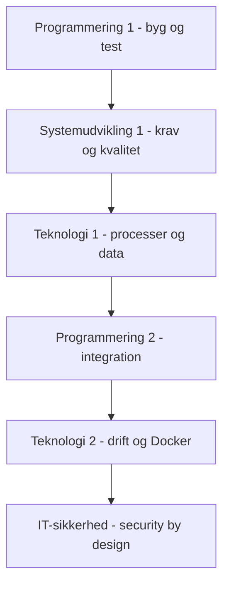

# Faglig kobling

MCP er ikke et selvstændigt læringsmål i studieordningen. Det er et tidssvarende udviklingsværktøj, som kan bruges til at arbejde med eksisterende læringsmål om programmering, systemudvikling, teknologi og sikkerhed.

Koblingen skal altid tage udgangspunkt i fagets mål. De studerende skal ikke blot få en AI-agent til at løse en opgave. De skal kunne forklare arkitekturen, kontrollere værktøjskald, teste resultatet og begrunde sikkerhedsvalg.

## Progression

Progressionen er vejledende. De enkelte fag kan arbejde parallelt med forskellige dele af samme eksempel.

## Materiale til fagene

- [Programmering 1](programmering-1/README.md)
- [Systemudvikling 1](systemudvikling-1/README.md)
- [Teknologi 1](teknologi-1/README.md)
- [Programmering 2](programmering-2/README.md)
- [Teknologi 2](teknologi-2/README.md)
- [IT-sikkerhed - Softwaresikkerhed](it-sikkerhed/README.md)

## Fælles minimumskrav

Uanset fag bør de studerende kunne:

1. forklare, hvilket problem MCP-serveren løser
2. skelne mellem host, klient, server og eksternt system
3. skelne mellem resources, tools og prompts
4. forklare hvilke data og handlinger serveren giver adgang til
5. kontrollere og teste serverens resultat
6. vurdere rettigheder og mulige risici
