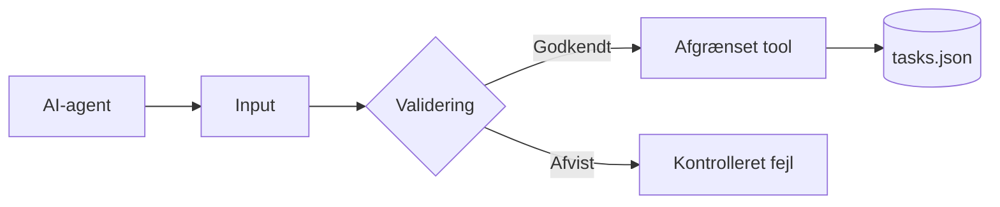

# MCP i IT-sikkerhed

Den mest direkte kobling i studieordningen for professionsbachelor i IT-sikkerhed er fagelementet **Softwaresikkerhed**.

Koblingen tager udgangspunkt i afsnit 2.6 i *Samlet studieordning for IT-sikkerhed, august 2026*.

[Tilbage til den faglige oversigt](../README.md)

## Hvorfor Softwaresikkerhed?

Fagelementet omhandler blandt andet:

- programkvalitet og konsekvenserne for IT-sikkerhed
- trusler mod software
- fejlhåndtering
- security by design og privacy by design
- opdagelse og forebyggelse af sårbarheder i programkode
- sikkerhedsvurdering af API'er og standardbiblioteker
- håndtering og test af lovlige og ikke-lovlige inputdata
- risikovurdering af programkode og softwarearkitektur

En MCP-server er et API-lignende sikkerhedsboundary mellem en AI-agent og et eksternt system. Dårligt designede tools kan give for brede rettigheder eller gøre det muligt at ændre de forkerte data.

## Foreslået aktivitet - sikkerhedsreview

De studerende gennemfører et sikkerhedsreview af task-serveren.

## Trusselsmodel

| Trussel | Mulig konsekvens | Tiltag i eksemplet |
| --- | --- | --- |
| Ugyldigt tool-input | Fejl eller korrupte data | Zod-skema og validering i `TaskStore` |
| Vilkårlig filsti | Læsning eller ændring af andre filer | Filstien er fastlagt af serveren |
| For bredt tool | Agenten kan udføre uønskede handlinger | Få, små og tydeligt beskrevne tools |
| Følsomme fejlbeskeder | Information lækkes til klienten | Generisk fejl til klienten og detaljer på `stderr` |
| Samtidige writes | Mistede eller korrupte ændringer | Ændringer sættes i kø i processen |
| Ondsindet tekst i en task | Prompt injection i AI-konteksten | Data behandles som utroværdigt input og kræver menneskelig kontrol |
| Container kører som root | Større skade ved kompromittering | Docker-processen kører som brugeren `node` |

## Test af ikke-lovligt input

De studerende skal mindst teste:

| Test | Forventet resultat |
| --- | --- |
| Titel med ét tegn | Afvises |
| Titel over 120 tegn | Afvises |
| Negativt task-id | Afvises |
| Decimalt task-id | Afvises |
| Ukendt task-id | Kontrolleret fejl uden dataændring |
| Ugyldig JSON i datafilen | Serveren returnerer en kontrolleret fejl |
| Tasktitel med en instruktion til AI'en | Vises som data og udføres ikke ukritisk |

## Security by design

De studerende skal vurdere følgende designvalg:

1. Hvorfor kan klienten ikke sende en filsti?
2. Hvorfor er `delete_all_tasks` ikke en del af serveren?
3. Skal `complete_task` kræve en særskilt godkendelse?
4. Hvilke tools bør være read-only?
5. Hvilke oplysninger må logges?
6. Hvordan skal serveren autorisere forskellige brugere i en remote version?
7. Hvordan begrænses en container med netværk, volumes og secrets?

## Leverance

Gruppen afleverer:

- en kort trusselsmodel
- en tabel med sikkerhedstest og resultater
- dokumentation af mindst én fundet svaghed eller begrænsning
- implementering af mindst ét relevant sikkerhedstiltag
- en kort vurdering af resterende risiko

## Mulige udvidelser

- revisionslog over tool-kald
- roller med forskellige rettigheder
- read-only mode
- bekræftelsestoken til risikable handlinger
- rate limiting
- integritetskontrol af datafilen
- autorisation på en remote Streamable HTTP-server

## Kontrolpunkt

AI-agenten må gerne hjælpe med analyse og test, men den studerende skal selv kunne begrunde trusler, sikkerhedstiltag og resterende risiko.

## Relevant materiale

- [Egen MCP-server](../../materiale/egen-mcp-server/README.md)
- [Docker-udvidelsen](../../materiale/docker/README.md)
- [MCP Security Best Practices](https://modelcontextprotocol.io/docs/2026-07-28/tutorials/security/security_best_practices)
