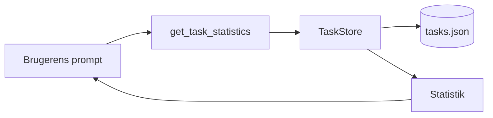

# MCP i Programmering 1

MCP-serveren kan anvendes som en lille, praksisnær Node.js-applikation, hvor de studerende arbejder med funktioner, datatyper, JSON, inputvalidering, fejlhåndtering og test.

[Tilbage til den faglige oversigt](../README.md)

## Kobling til læringsmål

Eksemplet kan understøtte arbejdet med:

- programmer af høj kvalitet i en hensigtsmæssig arkitektur
- anvendelse af et udbredt udviklingsmiljø og centrale biblioteker
- test, kvalitetssikring og dokumentation
- vurdering af kvalitative egenskaber ved kode

MCP er værktøj og kontekst. De programmeringsfaglige mål er stadig kodekvalitet, forståelse og test.

## Foreslået aktivitet

De studerende starter med den eksisterende server og tilføjer dette tool:

```text
get_task_statistics
```

Tool'et skal returnere:

- antal tasks i alt
- antal færdige tasks
- antal åbne tasks

## Krav

1. Beregningen placeres i `TaskStore`.
2. MCP-laget må kun formatere resultatet.
3. Der skrives mindst tre enhedstest.
4. En tom taskliste skal håndteres.
5. De studerende skal kunne forklare hele kaldet fra prompt til resultat.



## Kontrolpunkt

Den studerende skal vise, at resultatet kommer fra den aktuelle JSON-fil og ikke er beregnet eller gættet af sprogmodellen.

## Relevant materiale

- [Egen MCP-server](../../materiale/egen-mcp-server/README.md)
- [Hovedintroduktion til MCP](../../README.md)

