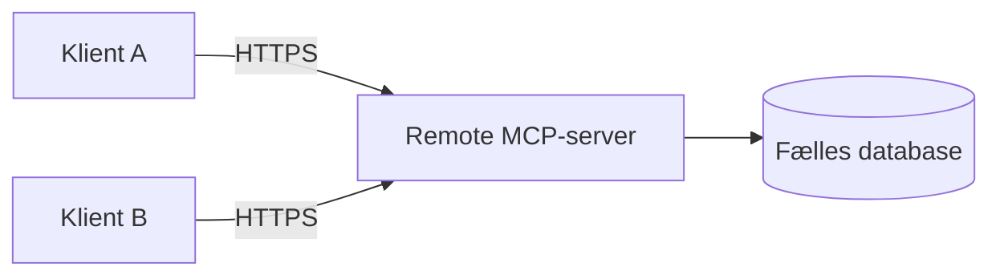

# MCP i Programmering 2

Programmering 2 er en stærk placering for MCP, fordi faget arbejder med distribuerede systemer, integration, samarbejdende processer og tidssvarende netværksteknologier.

[Tilbage til den faglige oversigt](../README.md)

## Kobling til læringsmål

Eksemplet kan understøtte arbejdet med:

- integration mellem heterogene komponenter og platforme
- distribueret programmering
- samarbejdende processer i en distribueret arkitektur
- tidssvarende netværksteknologier
- integration af systemer
- vurdering af konsekvenser ved et løsningsforslag

## Foreslået aktivitet

Den lokale server anvender `stdio`, fordi klienten og serveren kører på samme computer. Som udvidelse kan serverens forretningslogik udstilles over Streamable HTTP.

De studerende skal tage stilling til:

- transportvalg
- samtidige brugere
- fælles persistent data
- autentifikation og autorisation
- fejlhåndtering over netværk
- deployment

## Sammenligningsopgave

| Spørgsmål | Lokal `stdio` | Streamable HTTP |
| --- | --- | --- |
| Hvem starter serveren? | MCP-hosten | Servermiljøet |
| Hvor mange klienter? | Typisk én forbindelse | Flere mulige klienter |
| Netværk nødvendigt? | Nej | Ja |
| Autentifikation | Ofte lokal afgrænsning | Skal designes eksplicit |
| Skalering | Lokal proces | Server- og driftsproblem |

## GitHub som eksternt eksempel

I [ByteBites Java Copilot Workshop](https://github.com/krollchristensen/ByteBitesJavaCopilotWorkshopTest) forbindes IntelliJ med GitHubs eksterne MCP-server over HTTP. De studerende kan sammenligne GitHubs driftede server med den lokale task-server.

## Kontrolpunkt

De studerende skal kunne forklare, at en remote MCP-server er et distribueret system og ikke blot en lokal funktion, som sprogmodellen kalder.

## Relevant materiale

- [Egen MCP-server](../../materiale/egen-mcp-server/README.md)
- [MCP-transporter](https://modelcontextprotocol.io/specification/2026-07-28/basic/transports)

