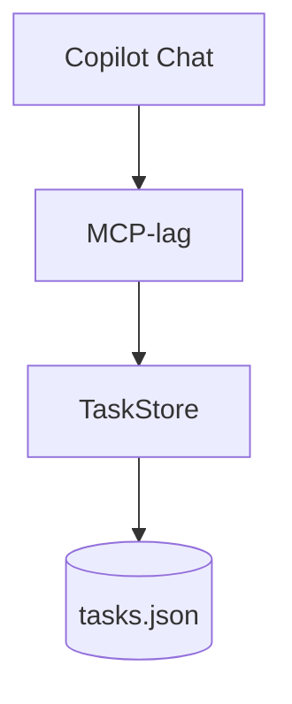

# MCP i Systemudvikling 1

I Systemudvikling 1 anvendes MCP-eksemplet til at arbejde med krav, arkitektur, kvalitetssikring og sporbarhed. Fokus er ikke først og fremmest at skrive serverkode, men at beskrive og kontrollere en ændring.

[Tilbage til den faglige oversigt](../README.md)

## Kobling til læringsmål

Eksemplet kan understøtte arbejdet med:

- analyse af en praksisnær problemstilling
- formulering og vurdering af krav
- anvendelse af en hensigtsmæssig softwarearkitektur
- planlægning og udførelse af test og kvalitetssikring
- dokumentation og sporbarhed mellem krav, implementering og test

## Foreslået aktivitet

Gruppen skal specificere en udvidelse, hvor en task kan få en prioritet:

```text
LOW
MEDIUM
HIGH
```

Inden implementering udarbejdes:

1. et kort behov
2. en user story
3. acceptkriterier
4. en opdateret datamodel
5. en sekvens for et MCP-tool-kald
6. en testtabel

## Arkitektur



Et vigtigt arkitekturvalg er, at MCP-laget beskriver serverens capabilities, mens `TaskStore` indeholder domæne- og datalogik.

## Sporbarhed

| Krav | Kode | Test |
| --- | --- | --- |
| Prioritet er obligatorisk | `TaskStore.addTask` | Afviser manglende prioritet |
| Kun tre værdier accepteres | Tool-inputskema | Afviser `URGENT` |
| Prioritet kan læses | `tasks://all` | Resource indeholder prioritet |

## Kontrolpunkt

De studerende skal kunne forklare, hvorfor en tydelig tool-beskrivelse og et præcist inputskema er en del af systemets krav og kvalitet - ikke blot teknisk konfiguration.

## Relevant materiale

- [Egen MCP-server](../../materiale/egen-mcp-server/README.md)
- [ByteBites-workshoppen](https://github.com/krollchristensen/ByteBitesJavaCopilotWorkshopTest)

