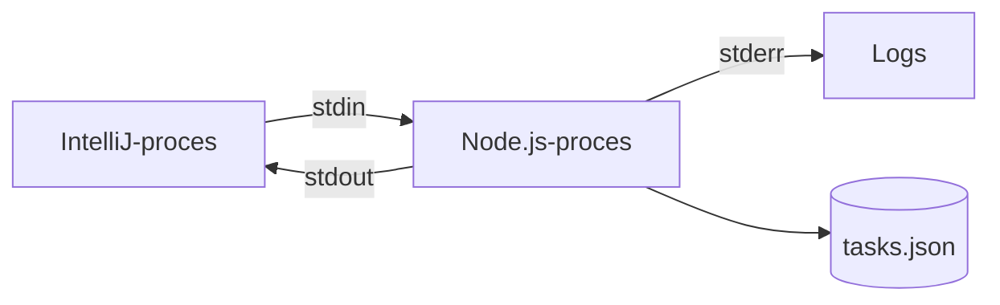

# MCP i Teknologi 1

I Teknologi 1 kan MCP-serveren anvendes til at undersøge lokale processer, standard streams, samtidighed og dataadgang.

[Tilbage til den faglige oversigt](../README.md)

## Kobling til læringsmål

Eksemplet kan understøtte arbejdet med:

- centrale funktioner i operativsystemer
- processer og kommunikation mellem processer
- samtidighed og synkronisering
- adgang til og opdatering af data

## Foreslået aktivitet

De studerende undersøger, hvad der sker, når IntelliJ starter serveren:

De skal forklare:

1. hvem der starter serverprocessen
2. hvordan processens levetid hænger sammen med klienten
3. hvorfor `stdout` ikke må bruges til almindelige logs
4. hvad der sker, når processen stoppes
5. hvordan samtidige ændringer kan skabe race conditions

## Praktisk forsøg

1. Start serveren gennem MCP Inspector.
2. Find Node.js-processen i operativsystemets procesoversigt.
3. Kald et tool og observer ændringen i filen.
4. Stop processen og prøv at kalde tool'et igen.
5. Fjern midlertidigt mutationskøen i `TaskStore` og diskutér mulige fejl ved samtidige writes.

## Mulig databaseudvidelse

Erstat `tasks.json` med en lille database, men behold de samme MCP-capabilities. Herefter kan de studerende sammenligne filadgang og databaseadgang uden at ændre klientens måde at arbejde på.

## Kontrolpunkt

Den studerende skal kunne adskille MCP-protokollen fra operativsystemets proces- og transportmekanismer.

## Relevant materiale

- [Egen MCP-server](../../materiale/egen-mcp-server/README.md)
- [MCP-transporter](https://modelcontextprotocol.io/specification/2026-07-28/basic/transports)

