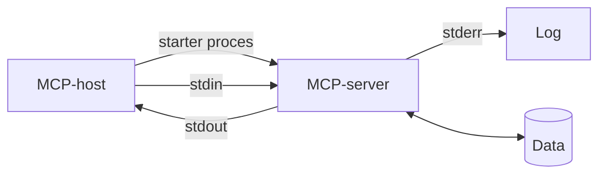

# MCP i Teknologi 1

MCP kan indgå i Teknologi 1 som en konkret anledning til at undersøge operativsystemer, processer, standard streams, samtidighed og databasesystemer. Undervisningen kan anvende enhver lokal MCP-server, som passer til det valgte tekniske fokus.

[Tilbage til den faglige oversigt](../README.md)

## Kobling til studieordningen

Teknologi 1 har fokus på teknologiske aspekter ved udvikling og programmering af IT-systemer, særligt operativsystemer, databasesystemer og samtidighed.

| Fokus i faget | Mulig MCP-aktivitet |
| --- | --- |
| Operativsystemer | Undersøg hvordan en MCP-host starter og stopper en lokal serverproces |
| Standard streams | Følg kommunikation gennem `stdin`, `stdout` og `stderr` |
| Samtidighed | Undersøg flere samtidige kald og adgang til delte ressourcer |
| Synkronisering | Afprøv mekanismer, der beskytter fælles data |
| Databasesystemer | Sammenlign filbaseret persistens med en databasebaseret løsning |
| Struktureret læring | Undersøg en ny runtime, database eller transport og formidl resultatet |

## Mulige undervisningsaktiviteter

- Start en lokal MCP-server fra en host og find processen i operativsystemets procesoversigt.
- Undersøg hvad der sker med serverprocessen, når klienten afbryder forbindelsen.
- Forklar hvorfor protokoldata og almindelige logs skal bruge forskellige streams.
- Observer eller log samtidige kald og identificér mulige race conditions.
- Sammenlign låse, køer eller transaktioner som beskyttelse af delte data.
- Erstat en filbaseret datakilde med en database uden at ændre klientens formål.
- Undersøg hvilke operativsystemrettigheder en lokal MCP-server arver.

## Teknisk sammenhæng

Diagrammet beskriver et generelt lokalt setup og er ikke bundet til et bestemt programmeringssprog eller domæne.

## Forslag til leverance

- proces- og kommunikationsdiagram
- kort teknisk forklaring af `stdio`
- dokumenteret forsøg med processtop eller samtidige kald
- vurdering af dataadgang og synkronisering
- refleksion over operativsystemets rolle

## Kontrolpunkt

Den studerende skal kunne skelne mellem MCP som applikationsprotokol og de mekanismer i operativsystemet, der starter processen, transporterer data og beskytter delte ressourcer.

## Kilde

- [Samlet studieordning for Datamatiker 2026](https://www.zealand.dk/wp-content/uploads/2016/09/Samlet-studieordning-Datamatiker-2026.pdf)
