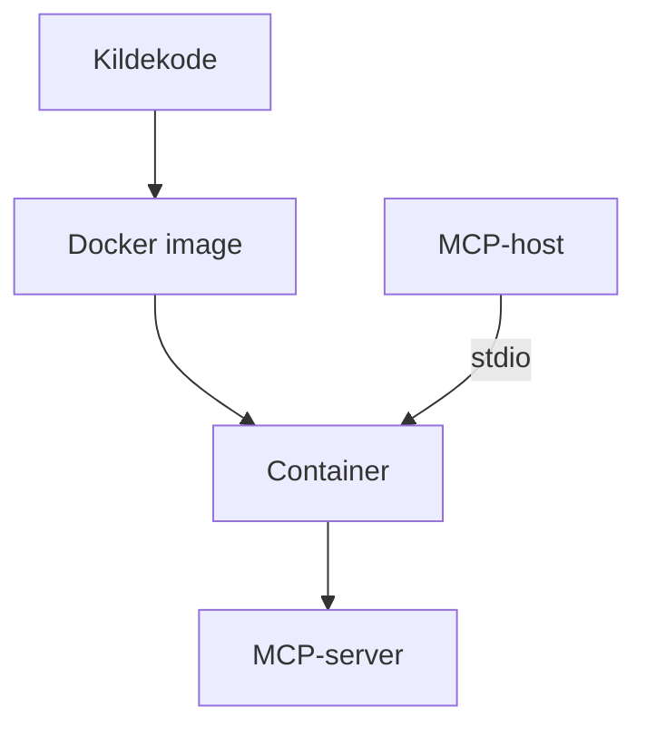
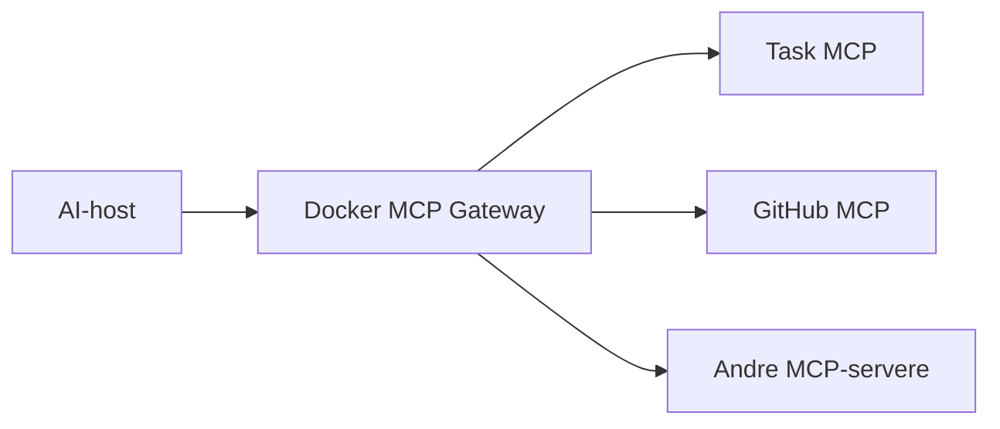

# MCP i Teknologi 2

I Teknologi 2 kan MCP-serveren bruges til at arbejde med containere, deployment, hosting, protokoller og sikkerhedsaspekter ved distribuerede systemer.

[Tilbage til den faglige oversigt](../README.md)

## Kobling til læringsmål

Eksemplet kan understøtte arbejdet med:

- virtualisering og containere
- deployment og hosting
- udbredte applikationsprotokoller
- sikkerhedsmæssige begreber og trusler
- teknologivalg i distribuerede systemer

## Foreslået aktivitet

De studerende kører først serveren direkte med Node.js og derefter i Docker.

De skal sammenligne:

- installation og afhængigheder
- isolation
- filsystemadgang
- persistens
- netværksadgang
- ressourceforbrug
- opdatering af serveren

## Krav til Docker-versionen

1. Serveren må ikke køre som root.
2. Kun nødvendige filer kopieres til imaget.
3. Der må ikke ligge secrets i imaget.
4. `-i` anvendes, så `stdio` holdes åben.
5. De studerende forklarer konsekvensen af `--rm`.
6. Persistens diskuteres, men er ikke et krav i grundeksemplet.

## Udvidelse med Gateway

Undersøg Docker MCP Toolkit og Gateway som et administrationslag for flere MCP-servere:

Diskutér hvornår Gateway reducerer konfigurationsarbejde, og hvornår den blot tilføjer et ekstra lag.

## Kontrolpunkt

Den studerende skal kunne begrunde, om serveren bør køres direkte, i en container eller som en remote service.

## Relevant materiale

- [Docker-udvidelsen](../../materiale/docker/README.md)
- [Docker MCP Catalog og Toolkit](https://docs.docker.com/ai/mcp-catalog-and-toolkit/)

