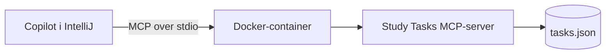
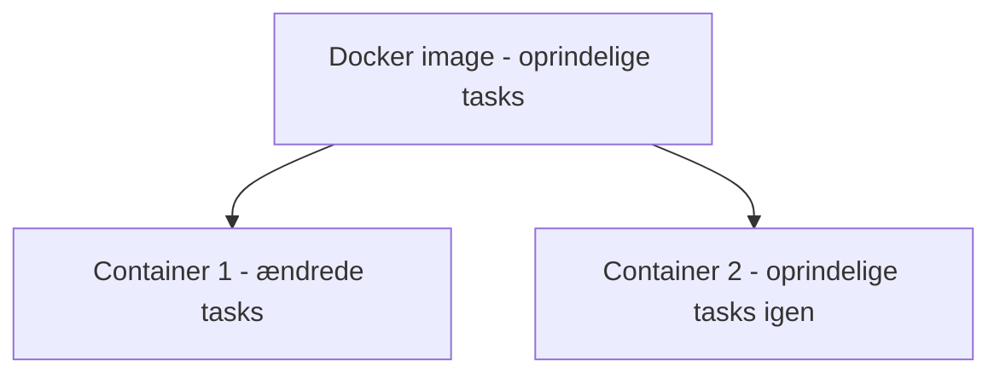
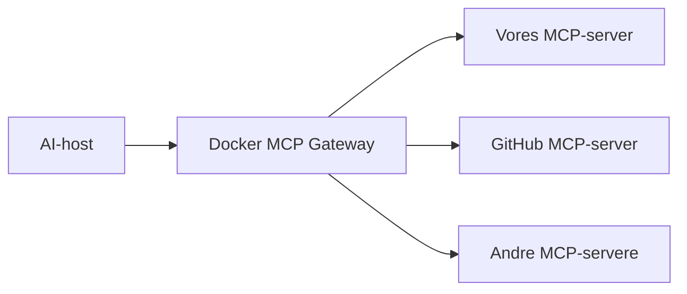

# Kør vores MCP-server i Docker

Dette materiale viser, hvordan den samme MCP-server kan afvikles i en Docker-container.

[Tilbage til introduktionen](../../README.md)

## Hvad ændrer Docker?

Docker ændrer ikke serverens resources, tools, prompts eller MCP-beskeder. Docker pakker serverens runtime, biblioteker, kode og startkommando i et ensartet miljø.



| Direkte Node.js | Docker |
| --- | --- |
| Node.js og pakker installeres på værten | Node.js og pakker findes i imaget |
| IntelliJ starter `node` | IntelliJ starter `docker run` |
| Data ligger direkte på værten | Data ligger som udgangspunkt i containeren |
| Færre lag og lettere fejlfinding | Ensartet og isoleret afvikling |

Til det første MCP-eksempel er direkte Node.js lettest. Docker-versionen er relevant, når fokus flyttes til containere, deployment, isolation og rettigheder.

## Forudsætninger

- Docker Desktop
- Docker skal være startet
- Det kørbare eksempel i `materiale/egen-mcp-server`

## Byg imaget

Åbn en terminal i `materiale/egen-mcp-server`:

```powershell
docker build -t mcp-study-tasks:1.0.0 .
```

Kontrollér imaget:

```powershell
docker image ls mcp-study-tasks
```

## Test containeren med MCP Inspector

```powershell
npx -y @modelcontextprotocol/inspector@latest docker run -i --rm mcp-study-tasks:1.0.0
```

Flaget `-i` holder standard input åbent, så Inspector kan sende MCP-beskeder til serveren.

Flaget `--rm` sletter containeren, når forbindelsen stopper. Imaget slettes ikke.

## Konfiguration i IntelliJ

```json
{
  "servers": {
    "study-tasks-docker": {
      "type": "stdio",
      "command": "docker",
      "args": [
        "run",
        "-i",
        "--rm",
        "mcp-study-tasks:1.0.0"
      ]
    }
  }
}
```

Deaktivér den direkte `study-tasks`-server, mens Docker-versionen testes. Ellers får Copilot to sæt næsten ens tools.

## Test fra Copilot

```text
Brug kun MCP-serveren study-tasks-docker.

1. Læs tasks://all.
2. Vis de åbne tasks.
3. Du må ikke ændre noget.
```

Prøv derefter `complete_task` og kontrollér resultatet gennem resourcen.

## Hvad sker der med data?

I denne enkle opsætning ligger `tasks.json` inde i containeren. Når containeren slettes, forsvinder ændringerne. Næste container starter med tasklisten fra imaget.

Det er en fordel i en demonstration, fordi alle kan begynde med de samme data. I et system med krav om varig lagring skal mappen monteres som et volume eller erstattes af en database.



## Sikkerhed

Docker giver proces- og filsystemisolation, men gør ikke automatisk MCP-serveren sikker.

Vurdér stadig:

- hvilke tools serveren eksponerer
- hvilke mapper der monteres
- om containeren har netværksadgang
- om den kører som root
- hvordan secrets tilføjes
- om output og tool-kald logges
- om brugeren skal godkende ændringer

Dockerfilen kører processen som brugeren `node` i stedet for `root`.

## Docker MCP Toolkit og Gateway

Eksemplet ovenfor kører vores server som en almindelig container direkte fra IntelliJ. Docker MCP Toolkit er et ekstra administrationslag, der kan samle flere MCP-servere i profiler og forbinde klienten gennem en Gateway.



Gateway er relevant, når flere servere skal administreres samlet. Den er ikke nødvendig for at forstå eller afvikle vores første server.

Læs mere i [Docker MCP-dokumentationen](https://docs.docker.com/ai/mcp-catalog-and-toolkit/).

## Refleksionsspørgsmål

1. Hvilke problemer løser Docker, som MCP ikke løser?
2. Hvilke problemer løser MCP, som Docker ikke løser?
3. Hvad sker der, hvis `-i` fjernes?
4. Hvorfor kører containeren ikke som root?
5. Hvornår skal data ligge i et volume eller en database?

## Næste trin

- [Tilbage til servereksemplet](../egen-mcp-server/README.md)
- [Teknologi 2](../../faglig-kobling/teknologi-2/README.md)
- [IT-sikkerhed](../../faglig-kobling/it-sikkerhed/README.md)
