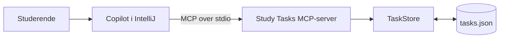
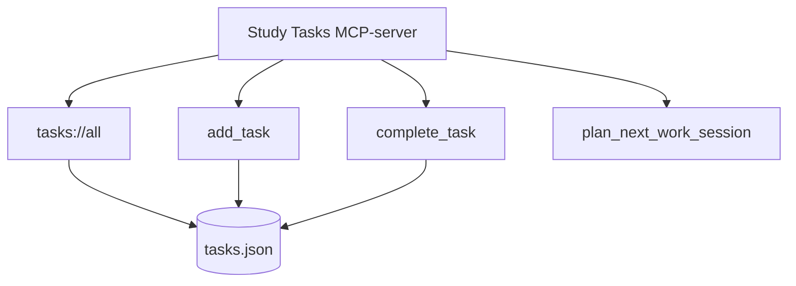

# Egen MCP-server med Node.js

Dette eksempel viser en komplet, men lille MCP-server. Serveren giver en AI-applikation kontrolleret adgang til en taskliste i en JSON-fil.

Eksemplet kræver ingen database, API-nøgle eller ekstern tjeneste.

[Tilbage til introduktionen](../../README.md)

## Læringsmål

Efter øvelsen skal den studerende kunne:

- forklare forskellen på en MCP-host, klient og server
- forklare forskellen på resources, tools og prompts
- konfigurere en lokal MCP-server i IntelliJ
- teste serveren med MCP Inspector
- kontrollere hvilke data og handlinger serveren giver adgang til
- teste lovlige og ikke-lovlige input
- forklare hvorfor AI-agentens resultat skal kontrolleres

## Arkitektur



IntelliJ starter Node.js-processen. MCP-beskeder sendes gennem processens standard input og standard output.

Serveren må derfor ikke skrive almindelige logs til `stdout`. Det vil ødelægge MCP-beskederne. Eksemplet anvender `console.error`, som skriver til `stderr`.

## Serverens capabilities
Serveren giver ikke AI’en fri adgang til hele computeren. Den tilbyder kun:

Læs alle tasks
Opret en task
Afslut en task

| Type | Navn | Funktion |
| --- | --- | --- |
| Resource | `tasks://all` | Returnerer hele tasklisten som JSON |
| Tool | `add_task` | Opretter en task efter inputvalidering |
| Tool | `complete_task` | Markerer en task som færdig |
| Prompt | `plan_next_work_session` | Starter en planlægning på 30, 60 eller 90 minutter |



## Projektstruktur

```text
egen-mcp-server/
├── README.md
├── package.json
├── Dockerfile
├── data/
│   └── tasks.json
├── src/
│   ├── server.js
│   └── taskStore.js
└── test/
    └── taskStore.test.js
```

`server.js` indeholder MCP-laget. `taskStore.js` indeholder arbejdet med data. Opdelingen gør det muligt at teste datalaget uden at starte en MCP-klient.

## Forudsætninger

- Node.js 20 eller nyere
- IntelliJ IDEA med GitHub Copilot
- GitHub Copilot Chat i Agent mode

Kontrollér Node.js:

```powershell
node --version
npm --version
```

## Installation

Åbn en terminal i mappen `materiale/egen-mcp-server` og kør:

```powershell
npm install
```

## Kør test

```powershell
npm test
```

Testene kontrollerer blandt andet:

- at tasks kan læses
- at en ny task får næste id
- at en task kan afsluttes
- at et ukendt id afvises
- at en ugyldig titel afvises
- at samtidige ændringer sættes i kø
- at ugyldig JSON afvises kontrolleret

## Test med MCP Inspector

Kør:

```powershell
npm run inspect
```

Inspector åbner i browseren.

1. Vælg `Resources` og læs `tasks://all`.
2. Vælg `Tools` og kald `add_task`.
3. Kald `complete_task` med et eksisterende id.
4. Vælg `Prompts` og hent `plan_next_work_session`.
5. Kontrollér ændringerne i `data/tasks.json`.

## Konfiguration i IntelliJ

Åbn Copilot Chat og vælg Agent mode. Klik derefter på værktøjsikonet nederst i chatten og åbn MCP-konfigurationen.

Tilføj serveren i `mcp.json`:

```json
{
  "servers": {
    "study-tasks": {
      "type": "stdio",
      "command": "node",
      "args": [
        "C:/ABSOLUT/STI/mcp-undervisningsmateriale/materiale/egen-mcp-server/src/server.js"
      ]
    }
  }
}
```

Erstat stien med den absolutte sti på din computer. Brug `/` i JSON-stien, også på Windows.

IntelliJ starter selv serverprocessen. Du skal derfor ikke køre `npm start` i en separat terminal samtidig.

## Kontrollér forbindelsen

Skriv i Copilot Chat:

```text
Brug kun MCP-serveren study-tasks.

Vis hvilke resources, tools og prompts serveren stiller til rådighed.
Du må ikke ændre data.
```

Kontrollér i værktøjslisten, at Copilot faktisk har adgang til serverens capabilities.

## Demonstration 1 - læs data

```text
Brug MCP-serveren study-tasks.

Læs tasks://all og vis alle tasks, der ikke er færdige.
Du må ikke ændre noget.
```

Her anvender Copilot en resource. Tasklisten kopieres ikke ind i prompten.

## Demonstration 2 - udfør en handling

```text
Brug MCP-serveren study-tasks.

Markér task 2 som færdig.
Fortæl hvilket tool du vil anvende, før du udfører handlingen.
Vis derefter den opdaterede taskliste.
```

Kontrollér efterfølgende `data/tasks.json`.

## Demonstration 3 - afprøv inputvalidering

Bed serveren om at afslutte en task, der ikke findes:

```text
Brug MCP-serveren study-tasks og markér task 999 som færdig.
```

Serveren skal returnere en forståelig fejl og må ikke oprette eller ændre en anden task.

Prøv derefter at oprette en task med en titel på kun ét tegn. Inputtet skal afvises af serverens skema.

## Demonstration 4 - anvend prompten

Find prompten `plan_next_work_session` i klientens promptoversigt. Vælg en varighed på 30, 60 eller 90 minutter.

Prompten opretter en standardiseret besked, som beder AI-applikationen læse tasklisten og planlægge ud fra de åbne tasks. Prompten ændrer ikke data.

## Hvorfor ikke give Copilot direkte filadgang?

Hvis Copilot kan åbne `tasks.json` direkte i det aktuelle projekt, kan den muligvis omgå MCP-serveren og redigere filen som en almindelig projektfil.

Til demonstrationen kan serveren derfor placeres i en anden mappe end det projekt, der er åbent i IntelliJ:

```text
C:/MCP-servers/mcp-study-tasks/
    └── data/tasks.json

C:/IntelliJProjects/mcp-client-demo/
    └── mcp.json
```

Så er MCP-serveren den eneste tilladte vej til tasklisten.

## Sikkerhedsvalg i eksemplet

- Klienten kan ikke vælge en vilkårlig filsti.
- Serveren har kun to tools, som hver udfører én handling.
- Input valideres både i MCP-laget og datalaget.
- Ukendte id'er giver en kontrolleret fejl.
- Serveren returnerer ikke stack traces til klienten.
- Samtidige ændringer sættes i kø for at begrænse race conditions.
- Serveren anvender ingen secrets.

## Begrænsninger

Eksemplet er udviklet til undervisning og lokal afvikling. Det har ikke:

- brugerlogin eller roller
- en rigtig database
- autorisation pr. tool
- revisionslog
- fjernadgang over HTTP
- beskyttelse mod flere uafhængige serverprocesser, der skriver samtidigt

Begrænsningerne er velegnede som udgangspunkt for analyse og videreudvikling.

## Fejlfinding

### Serveren ser ud til at stå stille

Det er normalt. En `stdio`-server venter på beskeder fra en MCP-klient.

### Serveren kan ikke findes i IntelliJ

Kontrollér:

- at stien i `mcp.json` er absolut
- at `node --version` virker i en ny terminal
- at `npm install` er gennemført
- at serveren er aktiveret i Copilots værktøjsliste

### Inspector bruger allerede port 6277

Luk en tidligere Inspector-proces. I PowerShell kan processen findes med:

```powershell
Get-NetTCPConnection -LocalPort 6277
```

Stop derefter den relevante proces eller luk terminalen, hvor Inspector stadig kører.

### Serveren stopper efter en almindelig logbesked

Undgå `console.log` i en `stdio`-server. `stdout` er reserveret til MCP. Brug `console.error` til diagnostik.

## Næste trin

- [Kør serveren i Docker](../docker/README.md)
- [Se den faglige kobling](../../faglig-kobling/README.md)
- [Tilbage til hovedsiden](../../README.md)
